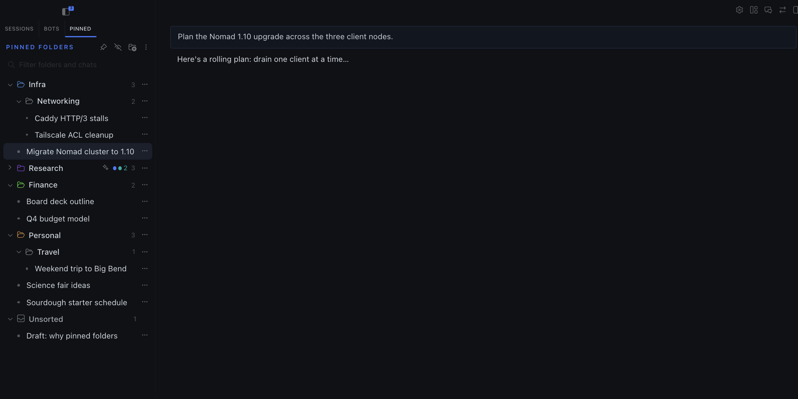
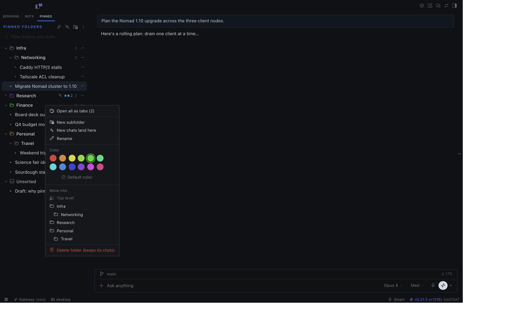
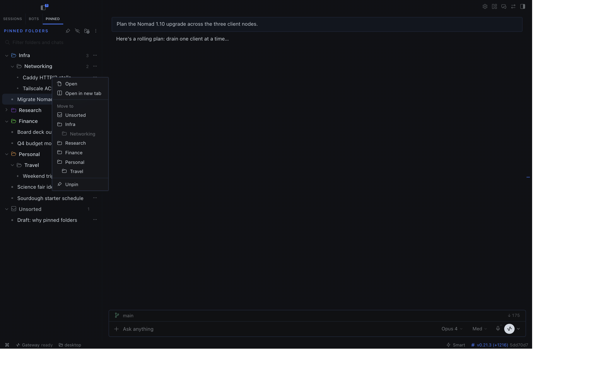
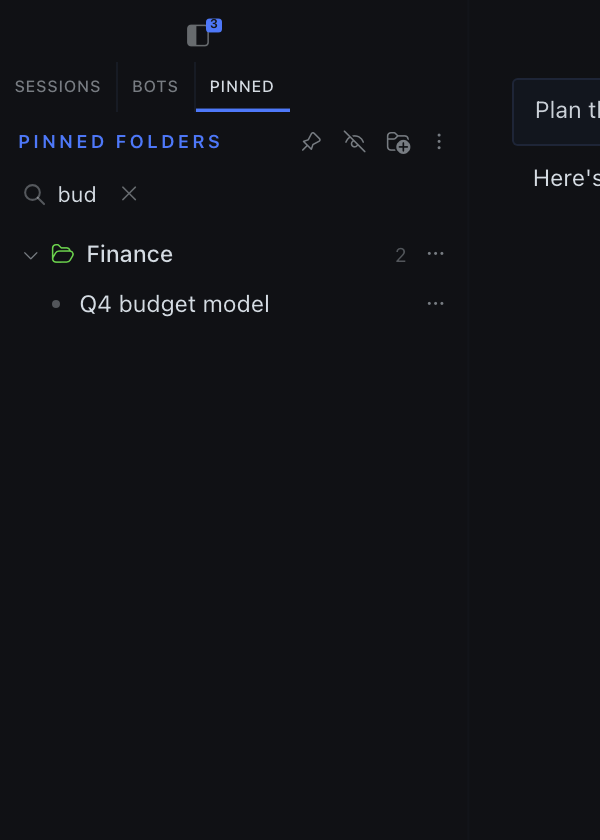

# Pinned folders

A **Pinned** tab in the Hermes Desktop sidebar that files your pinned chats into folders, nested as deep as you like.



Hermes shows pinned chats as one flat list. This plugin gives them their own tab next to **Sessions** and sorts them into folders you arrange yourself.

| Right-click a folder | Right-click a chat (full build) | Filter |
|---|---|---|
|  |  |  |

*The screenshots use demo chats in a separate test copy of the app. The collapsed **Research** folder shows the activity badge: an accent dot while an agent works inside, and a green count of unread chats.*

## Features

- **Folders, nested to any depth.** Create, rename (double-click), color, and delete. Deleting a folder moves its contents up one level, so no chat is lost.
- **Drag and drop.**
  - Drop a folder on the top or bottom edge of another folder to place it above or below. Drop it in the middle to nest it.
  - Drop a chat on a folder to file it, or on another chat to place it just above that chat.
  - Folder order is whatever you set. Nothing is sorted automatically.
- **Right-click menus.** Every chat and folder has the same actions as its ⋯ menu. Right-click empty space for **New folder** and the layout tools.
- **Activity on collapsed folders.** A closed folder shows a green count of unread chats inside it and an accent dot while an agent is working inside. This includes chats in subfolders.
- **Filter box.** Type to narrow down to matching chats, and to folders whose names match.
- **Open all as tabs.** Opens every chat in a folder, including its subfolders, as workspace tabs. ⌘-click or Ctrl-click a single chat to open it in a new tab.
- **Export and import layout.** Copies your folder layout as JSON so you can paste it on another machine. Importing replaces the folders only; pins are never changed.
- New pins land in **Unsorted**.
- The folder layout is stored in the app, separately for each connection.

## Two builds

| | Catalog build `desktop/plugin.js` | Full build `full/plugin.js` |
|---|---|---|
| Everything above | ✓ | ✓ |
| **Unpin** from the folder tab | – | ✓ |
| **Auto-pin chats you start** (not agent, cron, or workflow sessions), with an optional "New chats land here" folder | – | ✓ |
| **Hide core's flat Pinned list** in Sessions | – | ✓ |

The catalog build uses only the Hermes Desktop plugin SDK, which the [plugin catalog](https://github.com/NousResearch/hermes-agent/tree/main/plugin-catalog) requires.

The SDK has no way to pin, unpin, or hide a core sidebar section, so the full build reaches past it for those three features:

- It sends pin changes through the app's API bridge.
- It edits core's saved pin list.
- It hides the core Pinned section by changing the page directly.

These could break when the app updates. If one does, only that feature stops working. When the SDK adds these capabilities, they will move into the catalog build.

Both builds come from `full/plugin.js`. `node scripts/build.mjs` writes the catalog build by deleting every `// #full` … `// #end` block.

## Install

**From the catalog** (catalog build, once listed):

```sh
hermes plugins install pinned-folders
```

**By hand** (either build): copy one file into the desktop plugins folder **on the machine that runs the Hermes Desktop app**:

```sh
mkdir -p ~/.hermes/desktop-plugins/pinned-folders
curl -fsSL https://raw.githubusercontent.com/jacobhausler/hermes-pinned-folders/main/full/plugin.js \
  -o ~/.hermes/desktop-plugins/pinned-folders/plugin.js
```

For the catalog build, use `desktop/plugin.js` in that URL instead.

The app loads new plugins within a few seconds. If the tab doesn't appear, press ⌘K and run **Reload desktop plugins**.

## Develop

```sh
node scripts/build.mjs          # full/plugin.js -> desktop/plugin.js
node tests/ops.test.mjs         # catalog build
node tests/ops.test.mjs full    # full build
hermes plugins validate .       # catalog admission checks
```

The plugin is plain ESM with `jsx()` calls and no build step, so the app loads the file as-is.

See [CONTRIBUTING.md](CONTRIBUTING.md) to send a change. Coding agents should start at [AGENTS.md](AGENTS.md).

## License

MIT
