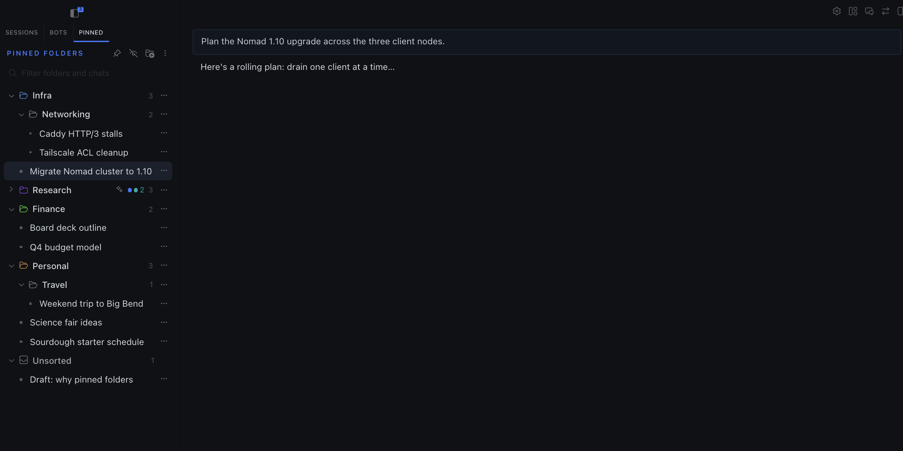
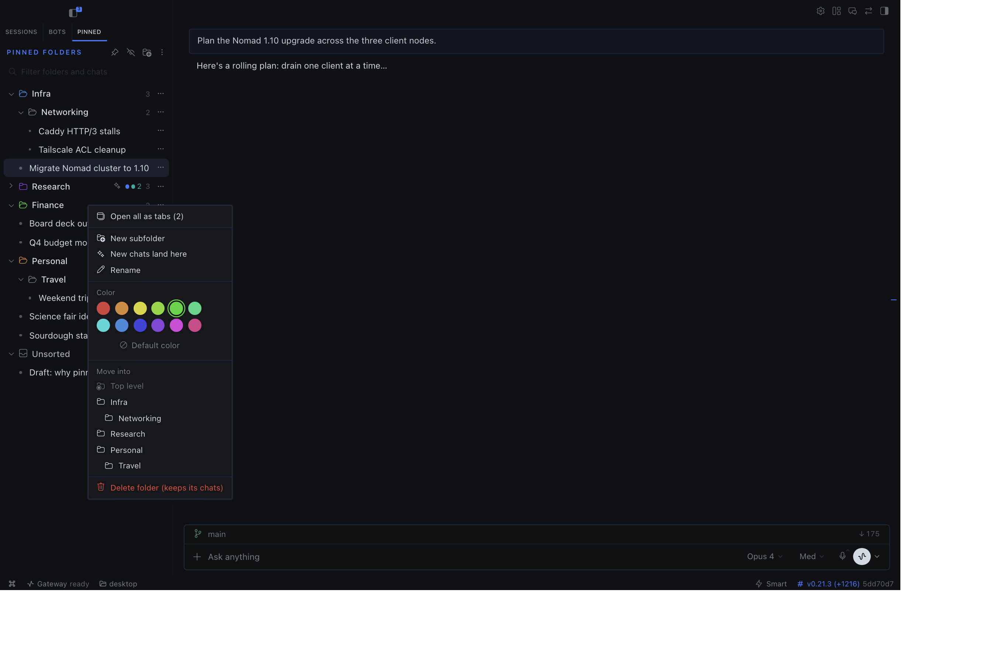
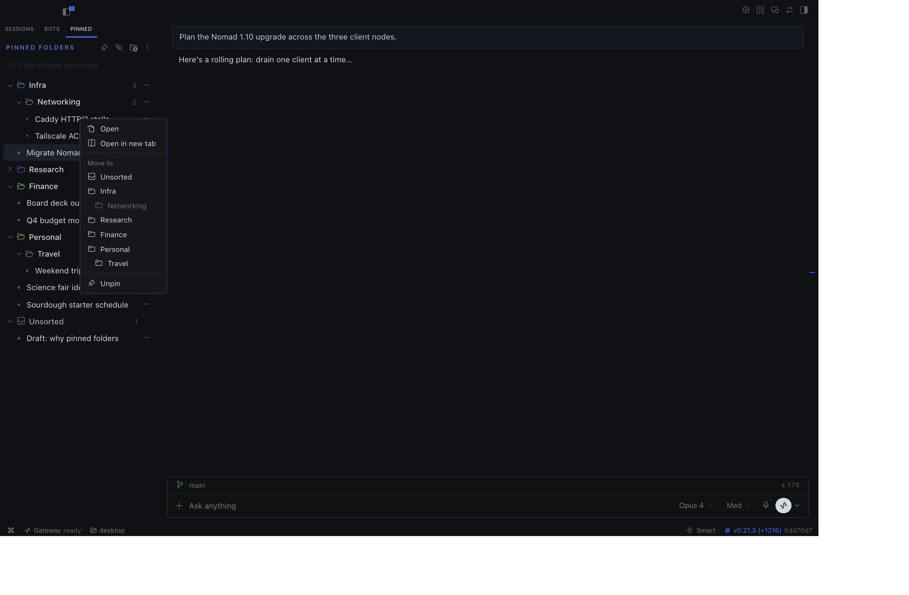
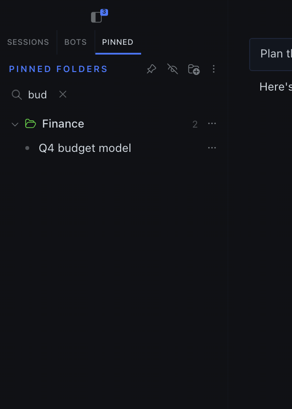

# Pinned folders

A **Pinned** tab in the Hermes Desktop sidebar that files your pinned chats into folders, nested as deep as you like.



Hermes shows pinned chats as one flat list. This plugin gives them their own tab next to **Sessions** and sorts them into folders you arrange yourself.

| Right-click a folder | Right-click a chat (full build) | Filter |
|---|---|---|
|  |  |  |

*The screenshots use demo chats in a separate test copy of the app. The collapsed **Research** folder shows the activity badge: an accent dot while an agent works inside, and a green count of unread chats.*

## Features

- **Folders, nested to any depth.** Create, rename (double-click), color, and delete. Deleting a folder moves its contents up one level, so no chat is lost.
- **Drag and drop.**
  - Drop a folder on the top or bottom edge of another folder to place it above or below. Drop it in the middle to nest it.
  - Drop a chat on a folder to file it, or on another chat to place it just above that chat.
  - Folder order is whatever you set. Nothing is sorted automatically.
- **Right-click menus.** Every chat and folder has the same actions as its ⋯ menu. Right-click empty space for **New folder** and the layout tools.
- **Chat actions like the Sessions list:** Open, Open in new tab, Open in new window, Copy session ID, Unpin, and Delete (asks first). The full build adds Rename (also by double-clicking), Mark as read/unread, and Archive. On older Desktop releases without `host.sessions.pin`, the catalog menu instead explains that you must update Desktop or unpin in Sessions.
- **Activity on collapsed folders.** A closed folder shows a green count of unread chats inside it and an accent dot while an agent is working inside. This includes chats in subfolders.
- **Filter box.** Type to narrow down to matching chats, and to folders whose names match.
- **Open all as tabs.** Opens every chat in a folder, including its subfolders, as workspace tabs. ⌘-click or Ctrl-click a single chat to open it in a new tab.
- **Export and import layout.** Copies your folder layout as JSON so you can paste it on another machine. Importing replaces the folders only; pins are never changed.
- New pins land in **Unsorted**.
- The folder layout is stored in the app, separately for each connection.

## Two builds

| | Catalog build `desktop/plugin.js` | Full build `full/plugin.js` |
|---|---|---|
| Everything above | ✓ | ✓ |
| **Unpin** from the folder tab | ✓ (SDK `host.sessions.pin` on supported Desktop) | ✓ (backend PATCH) |
| **Rename, Mark as read/unread, Archive** a chat | – | ✓ |
| **Auto-pin chats you start** (not agent, cron, or workflow sessions), with an optional "New chats land here" folder | – | ✓ |
| **Hide core's flat Pinned list** in Sessions | – | ✓ |

If a new chat cannot be resolved or pinned within 60 seconds, the full build shows a notification. Pin it manually from Sessions, or check the connection and send another message to retry; a failed pin request does not mark the chat as already handled.

The catalog build uses only the Hermes Desktop plugin SDK, which the [plugin catalog](https://github.com/NousResearch/hermes-agent/tree/main/plugin-catalog) requires.

The catalog build unpins only through the supported `host.sessions.pin(id, false)` SDK method: core updates its pin store and syncs the durable flag to the owning backend. If that method is missing in an older Desktop, the action is disabled with an update/"use Sessions" explanation; it does not touch core internals or merely remove a chat from the folder layout. Because core writes the backend pin in the background, the catalog build keeps the chat's folder placement until a fresh read of the pinned list shows it gone; if the backend keeps it pinned, the chat stays in its original folder and order.

Known limitation: catalog Unpin of a chat whose id exists in more than one profile follows core's active-profile resolution; the full build targets the row's own profile.

The SDK still has no supported door for rename, archive, read state, detecting new chats for auto-pin, or hiding a core sidebar section. The full build reaches past it for those features and retains its direct backend unpin path:

- It sends chat changes through the app's API bridge, using the same request the Sessions menu sends.
- For direct unpin it also scrubs core's saved pin list so core cannot re-pin the backend row.
- It hides the core Pinned section by changing the page directly.

These internals could break when the app updates. If one does, only that feature stops working. New SDK capabilities can replace full-only paths after verification.

Both builds come from `full/plugin.js`. `node scripts/build.mjs` writes the catalog build by deleting every `// #full` … `// #end` block.

## Install

**From the catalog** (catalog build, once listed):

```sh
hermes plugins install pinned-folders
```

**Local full Desktop build** (clone this repo on the machine running the Desktop app):

```sh
node scripts/install-local.mjs --variant full
```

The installer requires an explicit `--variant full|catalog`, copies that build from this checkout into `~/.hermes/desktop-plugins/pinned-folders/plugin.js` (or `$HERMES_HOME/desktop-plugins/...`), and prints the verified destination SHA-256. Use `--variant catalog` only when you deliberately want the SDK-only build. An existing different local file needs `--replace`; a detectable Hermes-managed package is never overwritten, even with `--replace`. To use a different home for testing, pass `--home PATH`. Do not use this local installer to update a catalog-managed install; update it with Hermes instead.

The app loads new plugins within a few seconds. If the tab doesn't appear, press ⌘K and run **Reload desktop plugins**.

## Develop

```sh
node scripts/build.mjs          # full/plugin.js -> desktop/plugin.js
node tests/ops.test.mjs         # catalog build
node tests/ops.test.mjs full    # full build
hermes plugins validate .       # catalog admission checks
```

The plugin is plain ESM with `jsx()` calls and no build step, so the app loads the file as-is.

See [CONTRIBUTING.md](CONTRIBUTING.md) to send a change. Coding agents should start at [AGENTS.md](AGENTS.md).

## License

MIT
